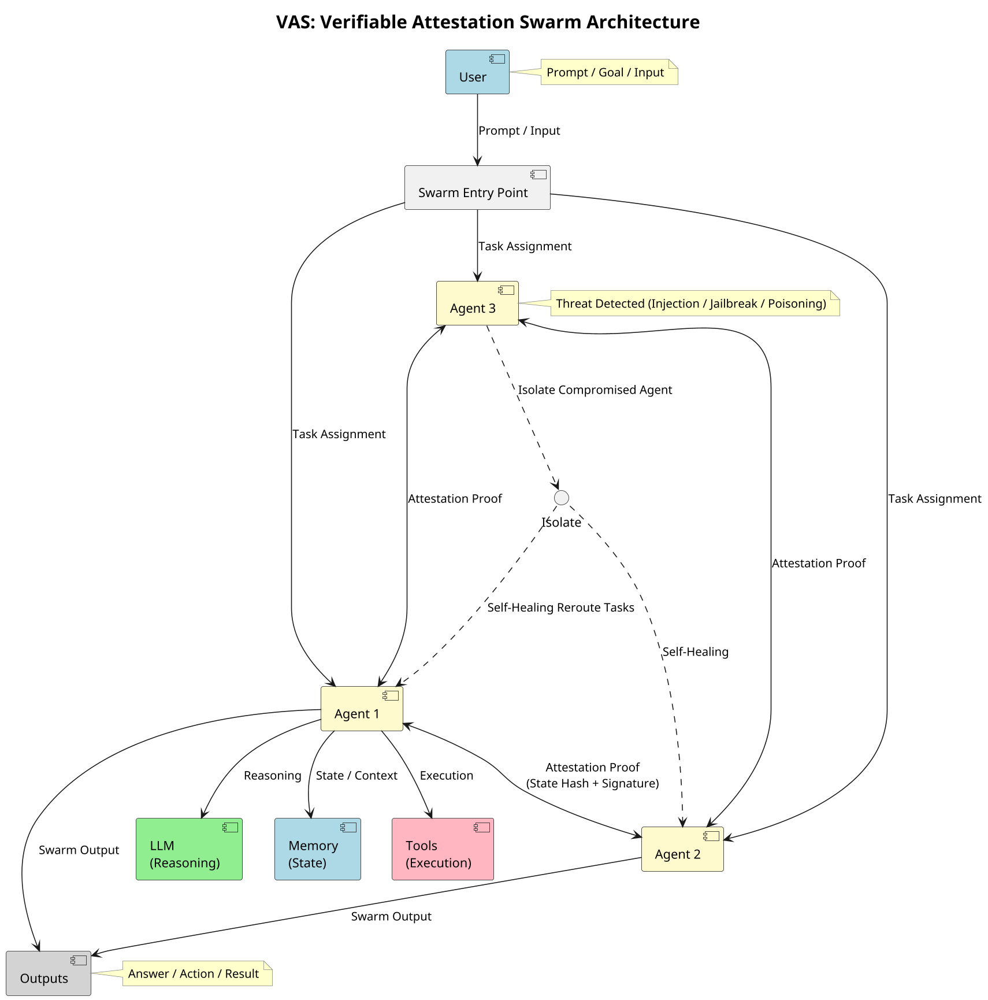

# Architecture

```plantuml

@startuml
skinparam monochrome false
skinparam shadowing false
skinparam dpi 150
skinparam backgroundColor white
skinparam titleFontSize 20
skinparam titleFontStyle bold

title VAS: Verifiable Attestation Swarm Architecture

' Top: User Input
[User] as User #ADD8E6
note right of User
  Prompt / Goal / Input
end note

' Swarm Entry Point (no central orchestrator, direct swarm coordination)
[Swarm Entry Point] as Swarm

' Agents (yellow/orange like original Agent box)
[Agent 1] as Agent1 #FFFACD
[Agent 2] as Agent2 #FFFACD
[Agent 3] as Agent3 #FFFACD

' Internal components per agent (matching agents-from-scratch style)
[LLM\n(Reasoning)] as LLM #90EE90
[Memory\n(State)] as Memory #ADD8E6
[Tools\n(Execution)] as Tools #FFB6C1

' Bottom: Outputs
[Outputs] as Output #D3D3D3
note right of Output
  Answer / Action / Result
end note

' Flows (user → swarm → agents → components → output)
User --> Swarm : Prompt / Input
Swarm --> Agent1 : Task Assignment
Swarm --> Agent2 : Task Assignment
Swarm --> Agent3 : Task Assignment

' Inter-agent attestation (VAS core innovation)
Agent1 <--> Agent2 : Attestation Proof\n(State Hash + Signature)
Agent2 <--> Agent3 : Attestation Proof
Agent1 <--> Agent3 : Attestation Proof

' Threat Detection & Self-Healing
note right of Agent3 : Threat Detected (Injection / Jailbreak / Poisoning)

Agent3 -.-> Isolate : Isolate Compromised Agent
Isolate -.-> Agent1 : Self-Healing Reroute Tasks
Isolate -.-> Agent2 : Self-Healing

' Component connections (inside agents)
Agent1 --> LLM : Reasoning
Agent1 --> Memory : State / Context
Agent1 --> Tools : Execution

' Output flow
Agent1 --> Output : Swarm Output
Agent2 --> Output : Swarm Output

' Styling (clean, professional)
skinparam componentStyle rectangle
skinparam ArrowFontSize 12
skinparam ArrowColor #333
skinparam NoteBackgroundColor #FFFFCC
skinparam NoteBorderColor #888

@enduml

```

